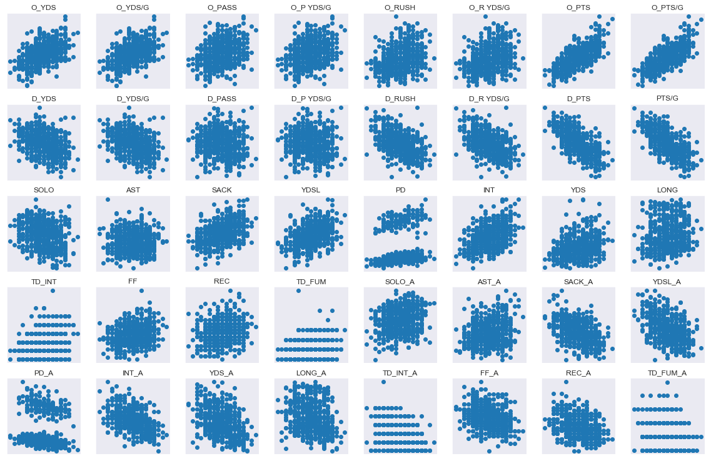

## NFL analysis using Pandas OLS and Scikit-Learn

This project is an analysis of NFL stats by season to determine, what stats are best correlated, both positively and negatively with overall wins in a season and to predict the total amount of wins a team should expect for a season, using a regression analysis model.

For the model in this project Total offensive yards gained and Total defensive yards surrendered, were not used, neither was points scored nor points relinquished, being that the aim was to predict winners with stats and not use those which actually determine the winner.

The project started with Webscraping data for every team from 2002-2018 off the ESPN website. The data was then cleaned and analyzed to see correlation between winning and other stats.

