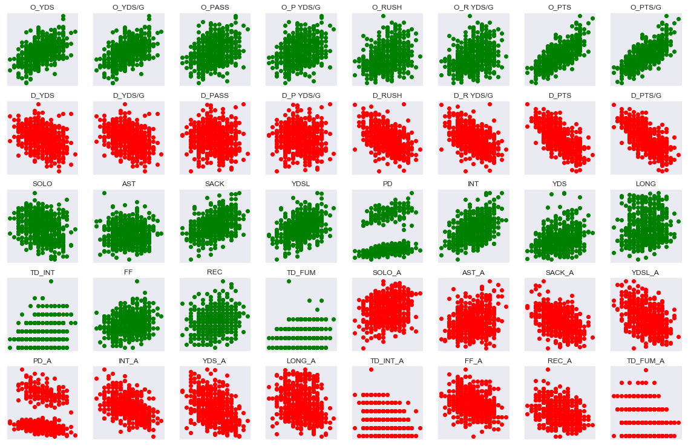
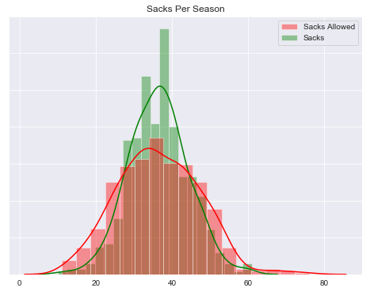
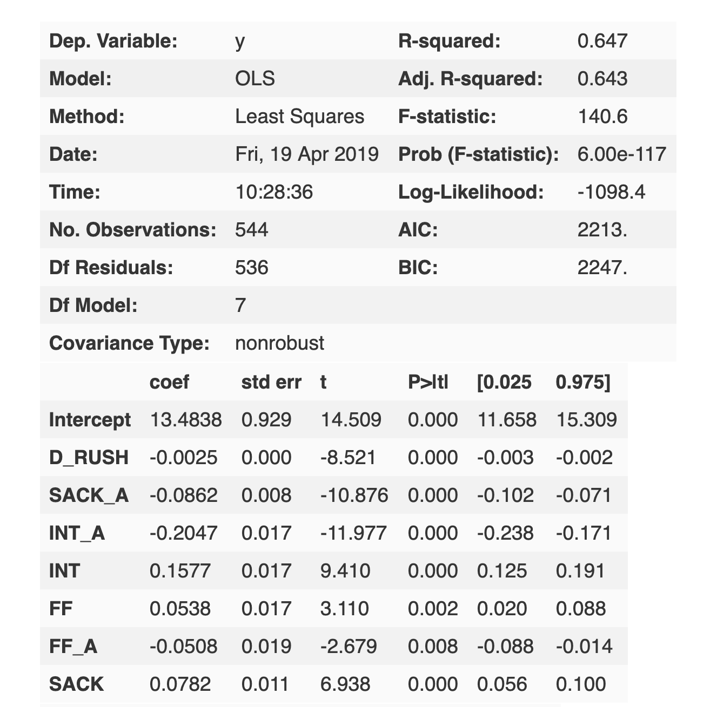
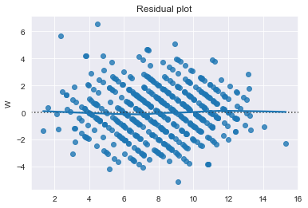

## NFL analysis using Pandas OLS and Scikit-Learn

This project is an analysis of NFL stats by season to determine, what stats are best correlated, both positively and negatively with overall wins in a season and to predict the total amount of wins a team should expect for a season, using a regression analysis model.

For the model in this project Total offensive yards gained and Total defensive yards surrendered, were not used, neither was points scored nor points relinquished, being that the aim was to predict winners with stats and not use those which actually determine the winner.

The project started with Webscraping data for every team from 2002-2018 off the ESPN website. The data was then cleaned and analyzed to see correlation between winning and other stats.

### Correlation with Winning

Some plots were then made using Matplotlib and Seaborn to see the distribution of the data.
An intersting find was, teams can be sacked more by opposing teams during the duration of the season, than the amount of sacks any particular team will be credited for.

An OLS model was then made to determine the best fit on predicting a teams total wins in a given season as the predicted variable. The decided open variables used to predict were Interceptions fumbles forced and sacks on both sides of the ball, as well as the amount of rush yards allowed for an opposing team.

Afterwards a Residual plot using Seaborn was made to see how well the predictions fit the actual data.

